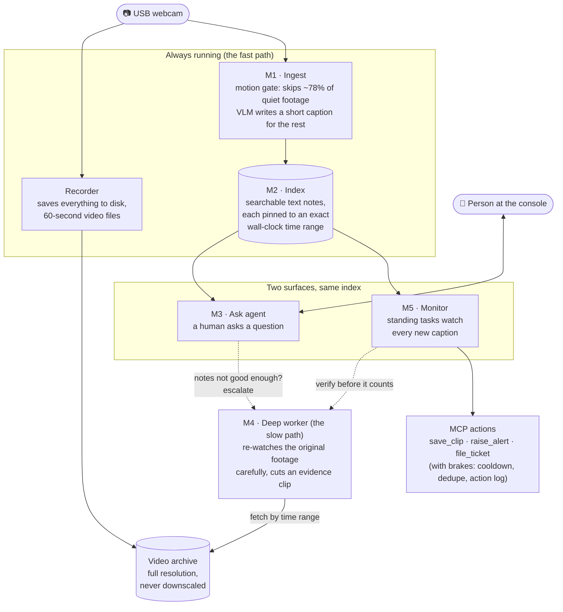
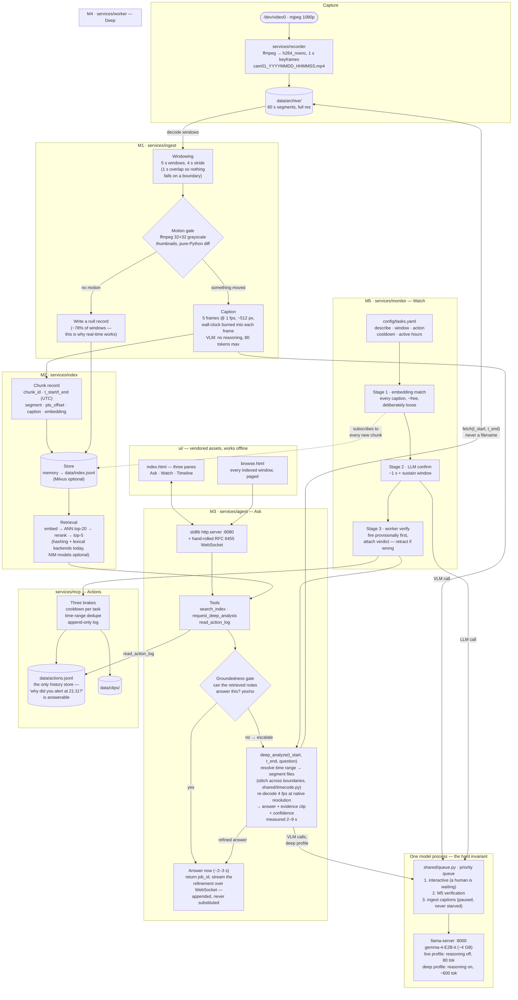

# Architecture

This document explains the whole system in plain language, first from 10,000 feet,
then close to the ground. The authoritative design is [`SPEC.md`](SPEC.md); the hard
rules are in [`CLAUDE.md`](CLAUDE.md).

## The idea in one paragraph

One camera records everything to disk, all the time. A cheap AI pass watches the live
feed and writes a short text note ("a white van reverses toward the loading door")
about every few seconds of footage — but only when something is actually happening.
Those notes go into a searchable index. When a human asks a question, the system
answers instantly from the notes; when the notes aren't good enough, it goes back and
**re-watches the original footage** carefully. Standing watch-tasks ("alert me if a
vehicle blocks the fire door") run against the same notes and fire real actions.
Everything runs on one machine, offline — no cloud.

That's why it's called **two-speed**: a fast, cheap, always-on pass, and a slow,
careful, on-demand pass. The system knows when its own quick summary isn't good
enough, and escalates itself.

---

## High level — what talks to what

**How to read it:** solid arrows are the everyday flow; dashed arrows are the
escalation — the moment the system decides its quick notes aren't trustworthy enough
and pays for a careful second look. Both surfaces (a human asking, a robot watching)
escalate to the **same** deep worker, and the deep worker's whole job is to turn a
*time range* back into the original pixels.

Three design rules make the picture work:

1. **The archive is sacred.** Recording is dumb and independent — no AI in that path,
   full resolution, so there is always ground truth to go back to.
2. **The index is nearly free.** Text notes cost ~13 MB/day against ~22–43 GB/day of
   video, so the system keeps everything and pays to look closely only when asked.
3. **Never block, never spam.** Answers arrive instantly and get *refined* later
   (never replaced), and actions pass through brakes so one event fires one alert,
   not thirty.

---

## Low level — how each piece actually works

### The one non-obvious join: time

Every chunk record carries `t_start`/`t_end` in UTC **plus** the segment filename and
a `pts_offset`. That tuple is the only link between a text note and the pixels it
describes. Video files restart their internal clock at zero every segment, so a
timestamp alone is meaningless — and an event can span two files, which is why
*everything* that touches video takes a **time range, never a filename**, and goes
through `shared/timecode.py` to stitch across boundaries. The wall clock is even
burned into the frames the VLM sees, so the model itself can cite real times back.

### The one hard resource rule: one model process

The box has 128 GB of *unified* memory — CPU and GPU share it, and a second model
instance doesn't run slowly, it crashes the machine. So one `llama-server` serves the
live captioner, the deep worker, and the ask LLM, with two request profiles (fast/no
reasoning vs. slow/reasoning) and a priority queue in front: a waiting human beats
background verification beats ingest, and ingest may be paused but never starved.

### The end-to-end speeds, measured on the real box

| Path | Latency |
|---|---|
| Event → caption in the index | ~4–9 s |
| Question → provisional answer | ~2–3 s |
| Escalation → deep, verified answer | +2–9 s (budget 20–60 s) |
| Quiet footage skipped by the gate | 78–81% |

### What runs where

| Process | Port | Started by |
|---|---|---|
| `llama-server` (the one model) | 8000 | `make serve` |
| `services/recorder` | — | `scripts/start.sh` |
| `services/ingest --follow` | — | `scripts/start.sh` |
| `services/agent` (API + UI) | 8080 | `scripts/start.sh` |

`services/index` and `services/mcp` are in-process libraries, not daemons. M5's
runner exists but its action-firing path is not yet wired end-to-end (see README,
"What is not wired yet").
